# AGENTS.md

SVT-AV1: production-grade AV1 video encoder library (C99) with a companion `SvtAv1EncApp`
CLI and a test-only decoder. Maintained under the Alliance for Open Media.

Canonical upstream: **https://gitlab.com/AOMediaCodec/SVT-AV1** (GitHub is a read-only mirror).

> If a `CLAUDE.local.md` file exists alongside this file, read and respect it — it
> contains developer-specific overrides that supplement this shared guidance.

## Rules (Read First)

**CRITICAL (YOU MUST):**

- Read `STYLE.md` and `CONTRIBUTING.md` before any code change. They are authoritative.
- New files MUST carry the **BSD-3-Clause-Clear + AOM Patent License 1.0** header
  (v0.9+). Use `Source/API/EbSvtAv1Enc.h:1-10` as the template; earlier BSD-2 headers
  in old files are legacy and must not be copied.
- Formatting is enforced by `.clang-format` (derived from Google, heavily tweaked):
  4 spaces (never tabs), 120-col limit, `InsertBraces: true` (braces mandatory even
  on single-statement `if`), pointer left (`int* p`), `CamelCase` types +
  `under_score` variables, `SortIncludes: false` (ordering is intentional).
- **Nomenclature is load-bearing** — SVT-AV1 may be statically linked next to
  libaom/libdav1d, so symbols are namespaced:
  - `svt_av1_*` for everything in the **public** API (`Source/API/`).
  - `svt_aom_*` for **internal** symbols (especially code ported from libaom/libdav1d).
  When you port or adapt code, rename accordingly.
- No `goto` except the standard error-unwind pattern (`STYLE.md:164`).
- Breaking the public ABI in `Source/API/*.h` requires bumping
  `SVT_AV1_ENC_ABI_VERSION` in `Source/API/EbSvtAv1Enc.h:32`, and CI's "Version
  consistency" check additionally requires `CMakeLists.txt` `project(... VERSION ...)`
  (`CMakeLists.txt:19`), the `EbSvtAv1.h` version macros, and the generated pkg-config
  version to all move together.
- Sign the **AOMedia Contributor Agreement** before your first contribution — see
  `Docs/Contribute.md` and <http://aomedia.org/license/>.
- Use a **valid email** on commits (`CONTRIBUTING.md:19`). No DCO sign-off is required
  by this repo, but the contributor agreement is.
- Fill in the MR template fully (`.gitlab/merge_request_templates/default.md`):
  Issue, Author, Performance impact (quality / memory / speed / 8 bit / 10 bit / N/A),
  Test set (obj-1-fast), Merge method.
- **One MR = one feature or fix.** Do not bundle unrelated changes.
- Prefer `rebase` over force-push when addressing review (`CONTRIBUTING.md:22`).
- Do not modify `third_party/` in-place; those trees (`aom`, `aom_dsp`, `fastfeat`,
  `googletest`, `safestringlib`) are maintained upstream.

## Common Commands

| Task | Command |
|------|---------|
| Release build | `cd Build/linux && ./build.sh release` |
| Debug build | `cd Build/linux && ./build.sh debug` |
| Build release + debug | `./build.sh all` |
| Build + run unit tests | `./build.sh release test` |
| Parallel build | `./build.sh release jobs=8 cc=clang cxx=clang++` |
| Link-time optimization | `./build.sh release --enable-lto` |
| Profile-guided optimization | `./build.sh release --enable-pgo` |
| C-only build (no SIMD) | `./build.sh release --c-only` |
| Disable AVX-512 | `./build.sh release --disable-avx512` |
| Sanitizer build | `./build.sh debug --sanitizer=address` (or `memory`, `thread`, `undefined`, `integer`) |
| Minimal / RTC / quiet | `./build.sh release --minimal-build` / `--rtc-build` / `--log-quiet` |
| Install | `./build.sh install` |
| Clean | `./build.sh clean` (wipes `Build/` and `Bin/`) |
| Windows (MSVC) | `cd Build\windows && build.bat 2019` |
| Direct CMake | `cmake -S . -B build -DBUILD_TESTING=ON && cmake --build build -j` |
| Encode (Y4M → IVF) | `./Bin/Release/SvtAv1EncApp -i in.y4m -b out.ivf --preset 8` |
| Encode (raw YUV) | `./Bin/Release/SvtAv1EncApp -i in.yuv -w 1920 -h 1080 -b out.ivf` |
| List unit tests | `./Bin/Release/SvtAv1UnitTests --gtest_list_tests` |
| Filter unit tests | `./Bin/Release/SvtAv1UnitTests --gtest_filter="*Transform*"` |
| API boundary tests | `./Bin/Release/SvtAv1ApiTests` |
| E2E tests | `SVT_AV1_TEST_VECTOR_PATH=/path/to/vectors ./Bin/Release/SvtAv1E2ETests` |
| Style check (full) | `./test/stylecheck.sh` |
| Style diff (single commit) | `python test/clang-format-diff.py -p1 < <(git diff -U0 HEAD~1)` |

Build outputs land under `Bin/Release/` and `Bin/Debug/` at the repo root, not
inside `Build/`. Main binary is `SvtAv1EncApp`.

If `SVT_AV1_TEST_VECTOR_PATH` is set, E2E tests use that absolute path regardless
of CWD — this is the recommended invocation. If unset, they fall back to a
CWD-relative path (`../../test/vectors` on POSIX, `../../../../test/vectors` on
Windows — see `test/e2e_test/VideoSource.cc:183-193`) that only resolves correctly
when the tests are launched from the build-output directory (typically
`Bin/Release/`).

## Architecture

Authoritative spec: **`Docs/svt-av1-encoder-design.md`** — read it when you need
algorithm-level detail. High-level orientation below.

The encoder is a **staged pipeline of stateless processes** (threads) that
communicate only through FIFO-passed refcounted objects. The
`sys_resource_manager.{c,h}` in `Source/Lib/Codec/` is the queue broker;
`object.h` defines the wrapper. Because state flows through queues — not shared
memory — the pipeline scales across cores without explicit locks in hot paths.

```mermaid
flowchart LR
    In[YUV / Y4M in] --> RC[Resource<br/>Coordination]
    RC --> PA[Picture<br/>Analysis]
    PA --> PD[Picture<br/>Decision]
    PD --> ME[Motion<br/>Estimation]
    ME --> IRC[Initial<br/>Rate Control]
    IRC --> SBO[Source-Based<br/>Ops / TPL]
    SBO --> PM[Picture<br/>Manager]
    PM --> RateC[Rate<br/>Control]
    RateC --> MD[Mode Decision<br/>MD + EncDec]
    MD --> DLF[Deblocking<br/>DLF]
    DLF --> CDEF[CDEF]
    CDEF --> REST[Restoration]
    REST --> EC[Entropy<br/>Coding]
    EC --> PKT[Packetization]
    PKT --> Out[IVF out]
```

Processes split into **control** singletons (`resource_coordination`, `pic_analysis`,
`pd`, `pic_manager`, `initial_rc`, `rc`, `packetization`) and **data** multi-instance
processes that run segment-parallel within a picture (`me_process`, `md_process`,
`enc_dec_process`, `dlf_process`, `cdef_process`, `rest_process`, `ec_process`). Each
has an input FIFO (`*_tasks.c`), optional reorder queue (e.g.
`packetization_reorder_queue.c`), and output FIFO (`*_results.c`). **Tracing
cross-stage bugs: follow `*_tasks.c → *_process.c → *_results.c`** — that naming is
the fastest way to find an inter-stage boundary.

Parallelism runs at three levels simultaneously:
1. Different processes run concurrently.
2. Multiple pictures flow through each stage.
3. Within a picture, **segments** (rectangular SB groups) are processed in parallel
   by multiple instances of a data process.

Do not introduce per-picture or per-SB mutable globals — they break the
segment-parallel model.

### Key concepts

- **SB (super block)**: 64×64 or 128×128 luma samples, atomic unit of most decisions.
- **Segment**: rectangular group of SBs, unit of intra-picture parallelism.
- **GoP / mini-GoP**: hierarchical prediction structure (`pred_structure.c`,
  configs in `Config/PredStruct_level*.cfg`).
- **SCS / PCS / PPCS**: Sequence / Picture / Picture-Parent Control Sets — the main
  state containers (`sequence_control_set.c`, `pcs.c`). PPCS lives a picture's full
  lifetime; child PCS is owned by later stages.
- **Presets**: `EncMode` enum `ENC_MR` (-1, research) → `ENC_M0` … `ENC_M13`
  in `Source/API/EbSvtAv1Enc.h:44`. Preset scaling is wired in
  `enc_mode_config.c` and `md_config_process.c`. When adding a new coding tool,
  hook its enable into `enc_mode_config.c` so it participates in the ladder.

## Code Layout

| Path | Role |
|------|------|
| `Source/API/EbSvtAv1.h`, `EbSvtAv1Enc.h` | Public C API + ABI (`SVT_AV1_ENC_ABI_VERSION`). Changes here are breaking. |
| `Source/App/` | `SvtAv1EncApp` reference binary — Y4M/YUV in, IVF out, CLI in `app_process_cmd.c` |
| `Source/Lib/Globals/` | `enc_handle` (lifecycle), `enc_settings` (parameter derivation + preset tables), `metadata_handle` |
| `Source/Lib/Codec/` | Encoder pipeline + algorithms — **95% of changes live here** (~237 files) |
| `Source/Lib/C_DEFAULT/` | Portable C reference kernels. Golden standard for every SIMD kernel; keeps `-DCOMPILE_C_ONLY=ON` functional |
| `Source/Lib/ASM_*` | SIMD kernels, one tree per ISA tier (see matrix below) |
| `third_party/` | Vendored `aom`, `aom_dsp`, `fastfeat`, `googletest`, `safestringlib` — **do not** rewrite in-place |
| `ffmpeg_plugin/` | FFmpeg patch sets for `n4.4` … `n6.1` (`--enable-libsvtav1`) |
| `Config/` | Sample prediction-structure + film-grain configs |
| `Docs/` | Design spec + per-tool `Appendix-*.md` + user guide |
| `Build/linux/build.sh`, `Build/windows/build.bat` | Canonical build wrappers |
| `test/` | Unit tests, `test/api_test/`, `test/e2e_test/`, `test/benchmarking/` (Python BD-rate) |

## SIMD Backend Matrix

Every hot kernel ships as a portable C reference plus one implementation per ISA
tier. Dispatch is runtime via function-pointer tables in
`Source/Lib/Codec/aom_dsp_rtcd.{c,h}` and `common_dsp_rtcd.{c,h}`.

| Arch | Tiers (lowest → highest) |
|------|--------------------------|
| x86_64 | `C_DEFAULT` → `ASM_SSE2` → `ASM_SSSE3` → `ASM_SSE4_1` → `ASM_AVX2` → `ASM_AVX512` |
| aarch64 | `C_DEFAULT` → `ASM_NEON` → `ASM_NEON_DOTPROD` → `ASM_NEON_I8MM` → `ASM_SVE` → `ASM_SVE2` |

**Kernel edit rule:** when you change a kernel, update **every** variant that
implements it (C_DEFAULT plus all active ASM tiers for both archs you touch),
or CI and the ASM correctness tests (`test/QuantAsmTest.cc`,
`test/InvTxfm2dAsmTest.cc`, `test/FwdTxfm2dAsmTest.cc`, `test/CdefTest.cc`, …)
will diverge silently. Cross-arch work can be cross-compiled via
`cmake/toolchains/` (see `Docs/ARM-Build-Guide.md`).

## Design Patterns

| Pattern | Key points |
|---------|------------|
| **Stateless processes + FIFO** | All inter-stage state flows through queues brokered by `sys_resource_manager.{c,h}`. No shared mutable state in hot paths. |
| **Segment parallelism** | Data processes run many instances per picture, one per segment. Do not introduce picture- or SB-scope globals. |
| **RTCD pointer tables** | `aom_dsp_rtcd.c` / `common_dsp_rtcd.c` pick the best ISA implementation at init. Add new kernel functions here first, then provide all variants. |
| **Preset-driven gating** | New tools opt into the quality/speed ladder via `enc_mode_config.c`. If your feature is unconditional, you likely skipped this step. |
| **Control set separation (SCS/PCS/PPCS)** | Long-lived data in SCS; per-picture state in PPCS; per-stage scratch in child PCS. |
| **Reorder queues** | Stages that must emit in decode order (`pd_reorder_queue.c`, `packetization_reorder_queue.c`) buffer out-of-order results from parallel upstreams. |

## Anti-Patterns / Gotchas

- **Silent ASM desync** — editing a C_DEFAULT kernel without updating every ASM
  sibling (or vice versa) produces subtle, ISA-dependent output differences that
  only fail on specific CI runners. Always run the relevant `*AsmTest.cc`.
- **ABI bump missed** — any struct layout change or new public symbol in
  `Source/API/*.h` requires `SVT_AV1_ENC_ABI_VERSION++`
  (`Source/API/EbSvtAv1Enc.h:32`) and a matching bump of the project version in
  `CMakeLists.txt:19`. CI's Version-consistency job will fail otherwise.
- **Build flags that change behavior** — the CMake options `MINIMAL_BUILD`,
  `LOG_QUIET`, and `RTC_BUILD` gate whole feature groups (`CMakeLists.txt:53-66`).
  Note the compile-time defines differ from the option names: enabling these
  emits `-DMINIMAL_BUILD=1`, `-DCONFIG_LOG_QUIET=1` (not `-DLOG_QUIET`), and
  `-DRTC_BUILD=1` respectively. New code must compile cleanly under each, and
  in-source guards must use the actual macro names (e.g. `#if CONFIG_LOG_QUIET`).
- **32-bit is unsupported** — `CMakeLists.txt:30-32` prints a warning; don't rely
  on 32-bit behavior and don't add workarounds for it.
- **Tabs** — rejected by clang-format and the `Style check` CI stage. Configure
  your editor to expand tabs to 4 spaces.
- **`goto`** — only for standard error-unwind. Reviewers will push back otherwise.
- **Hidden globals** — anything persistent per-picture or per-SB breaks segment
  parallelism. Put it in PCS/PPCS/SCS instead.
- **`third_party/` drift** — do not rewrite `aom`, `aom_dsp`, `fastfeat`,
  `googletest`, or `safestringlib` to match SVT style; upstream fixes there.
- **Copy-paste from libaom/libdav1d without renaming** — symbol collisions at
  static-link time. Apply the `svt_av1_` / `svt_aom_` rule on import.
- **Force-push mid-review** — use `git rebase` and a normal push; the maintainer
  will `rebase and merge` (or `squash and merge` with your consent).

## Development Workflow

1. Fork on GitLab, create a branch.
2. Read `STYLE.md` and `CONTRIBUTING.md`; apply the clang-format config from the
   tree root (or run `test/clang-format-diff.py` on your staged diff).
3. Build + smoke test: `cd Build/linux && ./build.sh release test`.
4. Run the relevant test suites: `SvtAv1UnitTests` always; `SvtAv1ApiTests` if
   you touched the API; `SvtAv1E2ETests` (with `SVT_AV1_TEST_VECTOR_PATH`) if
   you touched the pipeline.
5. Measure quality/speed impact on **obj-1-fast** (Xiph derf set; link in the MR
   template) when claiming a Performance impact box.
6. Open a GitLab MR, fill in the template (Issue, Author, Performance impact,
   Test set, Merge method), tag a maintainer.
7. Address review comments with normal pushes (no force-push); the maintainer
   will merge.

## Git / MR Policy

- Canonical remote is GitLab; GitHub is a **read-only mirror** — do not open PRs
  there, they won't be reviewed.
- **One MR = one topic.** Split mixed work.
- Make clear, concise commits — one commit per feature or issue where practical.
  Use a pingable GitLab username in the MR's "Author(s)" section.
- Maintainers use `rebase and merge` by default; `squash and merge` only with
  the author's explicit consent (template checkbox).
- Use a valid email on commits (`git config user.email`).

## CI / Testing

GitLab CI is driven by `.gitlab-ci.yml`. Pipeline stages (in order):
`check → compile → standalone → ffmpeg → test → test-2 → test-3`.
The last two are used for weekend testing against the `aom-testing` repo.

| Layer | Location | Notes |
|-------|----------|-------|
| Style check | `.gitlab-ci.yml` `Style check` job + `test/stylecheck.sh` | clang-format diff on the MR range; fails build on tab/format drift |
| Static analysis | `cppcheck --enable=all` via `compile_commands.json` | Excludes `third_party/` and assembly |
| Version consistency | CI job | Enforces `CMakeLists.txt` VERSION, `EbSvtAv1.h` macros, and pkg-config output all match |
| Compile matrix | `.gitlab/workflows/{linux,windows,macos,bsd}` | Multiple toolchains, ccache; in-tree cross toolchains under `cmake/toolchains/` |
| Unit tests | `test/*.cc` + `SvtAv1UnitTests` | Kernel / transform / SIMD correctness; no external data |
| API tests | `test/api_test/` + `SvtAv1ApiTests` | Parameter boundary and validation checks |
| E2E tests | `test/e2e_test/` + `SvtAv1E2ETests` | `./build.sh release test` builds the binaries but does **not** download test vectors; run the `TestVectors` CMake target separately (`cmake --build <build-dir> --target TestVectors`) or point `SVT_AV1_TEST_VECTOR_PATH` at a local copy |
| Benchmarking | `test/benchmarking/` (Python) | BD-rate tools, obj-1-fast harness |
| Nightly / weekend | `.gitlab/workflows/{nightly,standard}` + remote `aom-testing` include | Triggered by schedule, not by every MR |

When a kernel-level bug is suspected, run the specific ASM test that covers it
(`test/QuantAsmTest.cc`, `test/InvTxfm2dAsmTest.cc`, `test/FwdTxfm2dAsmTest.cc`,
`test/CdefTest.cc`, `test/DeblockTest.cc`, `test/RestorationPickTest.cc`, …)
rather than the full suite — they run in seconds and localize the ISA that
diverged.

## Key Documentation

Prefer `Docs/` over re-reading source for algorithm-level detail.

| Topic | Path |
|-------|------|
| Code style | `STYLE.md` |
| Contributing process | `CONTRIBUTING.md`, `Docs/Contribute.md` |
| Build guide | `Docs/Build-Guide.md` |
| ARM build | `Docs/ARM-Build-Guide.md` |
| Encoder design (authoritative) | `Docs/svt-av1-encoder-design.md` |
| User guide | `Docs/svt-av1_encoder_user_guide.md` |
| Parameters | `Docs/Parameters.md` |
| Common questions (LTO/PGO/preset/GOP/HDR) | `Docs/CommonQuestions.md` |
| FFmpeg integration | `Docs/Ffmpeg.md` + `ffmpeg_plugin/README.md` |
| System requirements | `Docs/System-Requirements.md` |
| Mode decision | `Docs/Appendix-Mode-Decision.md` |
| Rate control | `Docs/Appendix-Rate-Control.md` |
| CDEF | `Docs/Appendix-CDEF.md` |
| Deblocking filter | `Docs/Appendix-DLF.md` |
| Restoration filter | `Docs/Appendix-Restoration-Filter.md` |
| TPL | `Docs/Appendix-TPL.md` |
| Global motion | `Docs/Appendix-Global-Motion.md` |
| Film grain | `Docs/Appendix-Film-Grain-Synthesis.md` |
| Super-resolution | `Docs/Appendix-Super-Resolution.md` |
| Variance boost | `Docs/Appendix-Variance-Boost.md` |
| Alt-refs, switch frames, palette, CfL, IBC, OBMC, recursive intra, TX search, … | other `Docs/Appendix-*.md` files |
